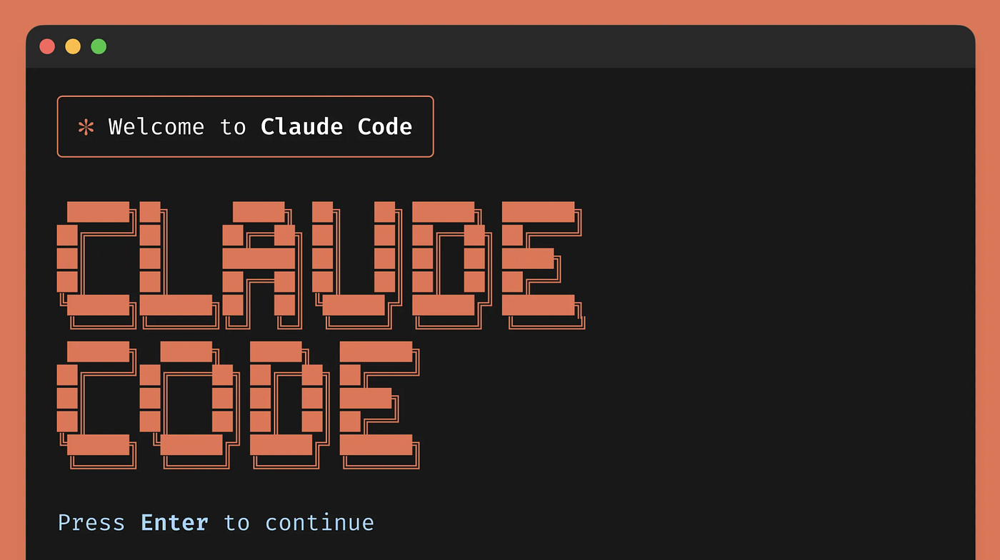

<div align="center">



# bb

**Developer workflow skills for [Claude Code](https://github.com/anthropics/claude-code)**

Move fast. Commit clean. Diagnose properly.

[](LICENSE)
[](.claude-plugin/plugin.json)
[](https://github.com/anthropics/claude-code)

</div>

---

## Install

```
/plugin marketplace add brandonrbridges/claude-skills
```

All commands are prefixed with `bb:`. Run `/bb:help` for a quick reference.

---

## Commands

| Command | Purpose |
|:--------|:--------|
| [`/bb:auto`](#bbauto) | Full autonomous mode — stop asking, start doing |
| [`/bb:commit`](#bbcommit) | Conventional commits, agent-only files, rebase + push |
| [`/bb:sweep`](#bbsweep) | Tidy a messy tree into logical grouped commits |
| [`/bb:check`](#bbcheck) | Type-check, lint, build — report issues with fix options |
| [`/bb:pr`](#bbpr) | Create a pull request from branch commits |
| [`/bb:diagnose`](#bbdiagnose) | Cross-codebase bug diagnosis with parallel agents |
| [`/bb:shad`](#bbshad) | shadcn/ui best practices — Tailwind v4, OKLCH, composition |
| [`/bb:anchor`](#bbanchor) | Checkpoint state to survive context compression |
| [`/bb:dispatch`](#bbdispatch) | Orchestrate parallel agent teams for complex tasks |

---

## Skills

### `/bb:auto`

Switches Claude to full autonomy. No more "shall I proceed?" — CLAUDE.md becomes the sole guardrail. Every coding standard and convention still applies, you just stop getting asked permission for every action.

Still pauses for genuinely dangerous operations: force push, deleting branches, posting externally.

### `/bb:commit`

Commits only the files you changed this session using conventional commit format. Compares against the git status snapshot from session start so it never touches files that aren't yours.

Rebases on remote and pushes. No AI attribution, no `Co-Authored-By`, no "as requested" — commits read like a human wrote them.

### `/bb:sweep`

For when your working tree is a mess — maybe multiple agents ran, maybe changes piled up. Reads every dirty file, groups them by intent into logical commits, orders them by dependency (shared packages first, then API, then frontend), and pushes.

Matches your existing commit style from `git log`.

### `/bb:check`

Runs type-check, lint, and build in parallel. Reports every error and warning, then asks what you want to do:

| Option | What happens |
|:-------|:-------------|
| **Fix everything** | All errors and warnings resolved, committed as a clean slate |
| **Fix build-blockers only** | Type errors and lint errors fixed, warnings left alone |
| **Proceed anyway** | Nothing changes — you continue with awareness of what's broken |

### `/bb:pr`

Generates a PR from your branch commits. Reads the full diff — not just the latest commit — writes a human-readable title and summary, pushes, and creates via `gh`.

### `/bb:diagnose`

For bugs that cross service boundaries. Dispatches parallel Explore agents across all affected packages and services simultaneously, synthesises findings, and proposes a fix with evidence — but doesn't implement until you approve.

Works with any project structure: monorepos, multi-repo setups, or single repos with multiple layers.

### `/bb:shad`

Enforces shadcn/ui best practices when building UI. Tailwind v4 with `@theme inline` (no `tailwind.config.ts`), OKLCH color format, semantic CSS variables with foreground pairs, `data-slot` attributes, React 19 patterns (no `forwardRef`), and proper composition using Radix primitives.

Covers theming, forms (react-hook-form + Zod), responsive dialog/drawer patterns, skeleton loading states, and the common mistakes table that catches the v3-to-v4 pitfalls.

### `/bb:anchor`

Checkpoints your current state — what was asked, what's done, what's left, which files were touched — into a task that survives context compression. In long sessions, earlier messages get compressed and the agent loses track of scope, progress, and decisions. Anchors fix that.

Also acts as a scope guard: before doing anything new, re-read the anchor and check if it's within scope.

### `/bb:dispatch`

Orchestrates a structured team of parallel agents for complex, multi-part tasks. Runs in phases: scouts explore the codebase in parallel, you synthesise their findings into a plan, implementers execute independent pieces in worktrees, a reviewer checks quality, and a validator runs the build. Each agent gets only the context it needs — no bloated prompts, no overlapping work.

---

## Philosophy

> These skills are opinionated. They share a point of view about how agents should work with your code.

**No AI fingerprints.** Commits, PRs, and code should read like a human wrote them.

**Move fast within guardrails.** Autonomy means speed, not recklessness. Project standards always apply.

**Surface everything, then let the user decide.** Check and diagnose show the full picture before acting.

**Logical grouping over mechanical grouping.** Commits are organised by intent, not by file type.

---

## Contributing

If you've got a skill that fits the philosophy — opinionated workflow discipline, no AI fingerprints, surface-then-decide — PRs are welcome.

## Versioning

This plugin follows [semver](https://semver.org). Bump the version in `.claude-plugin/plugin.json` and add an entry to [`CHANGELOG.md`](CHANGELOG.md) when updating skills.

---

<div align="center">

MIT License — [Brandon Bridges](https://github.com/brandonrbridges)

</div>
