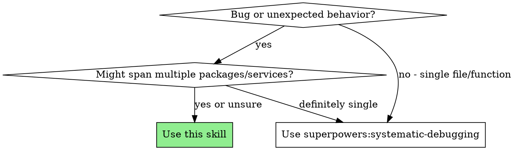
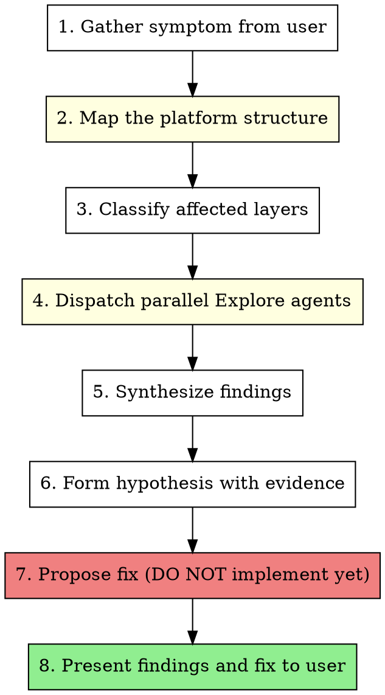

# Investigate

Diagnose bugs across your entire platform by dispatching parallel Explore agents across all relevant packages, services, and layers, then synthesizing findings into a root cause analysis before implementing anything.

**Core principle:** Gather evidence from ALL potentially affected layers BEFORE forming hypotheses. Cross-boundary bugs hide at service interfaces.

## When to Use



**Use when:**
- 504/502/timeout errors (cascading across services)
- Authentication failures (JWT, cookies, token refresh, middleware)
- Data appears wrong on frontend but correct in DB (serialization, type drift)
- API returns unexpected response (contract mismatch between layers)
- Performance degradation (DB pool, N+1 queries, missing indexes, connection limits)
- Feature broken after deploy (migration order, env vars, config mismatch)
- "It works locally but not in production"
- Bug symptoms appear in one layer but root cause is in another

**Don't use when:**
- Bug is clearly in one file/function (use systematic-debugging instead)
- UI-only issue (styling, layout, client state)
- You already know the root cause and just need to fix it

## The Process



### Phase 1: Gather Symptom

Ask the user (if not already provided):
- **What's happening?** (error message, unexpected behavior, screenshot)
- **When did it start?** (after deploy, after migration, intermittent)
- **Who's affected?** (all users, one tenant, one role)

### Phase 2: Map the Platform

Before investigating, understand what you're working with. Detect the project structure:

**Monorepo** (Turborepo, Nx, Lerna, pnpm workspaces):
```bash
# Find all packages/apps
ls apps/ packages/ services/ 2>/dev/null
cat package.json | grep workspaces
cat turbo.json pnpm-workspace.yaml nx.json 2>/dev/null
```

**Multi-repo** (sibling directories, microservices):
```bash
# Check if user has referenced other repos or services
# Ask the user which repos/services are involved
```

**Single repo with layers** (e.g. API + DB + workers in one repo):
```bash
# Map the directory structure
ls src/
```

Build a mental map of: **services, shared packages, API boundaries, databases, and external integrations.**

### Phase 3: Classify Affected Layers

Map the symptom to layers. Common patterns:

| Symptom | Likely Layers | Start Here |
|---------|--------------|------------|
| 504/timeout | All services in request chain | DB config, connection pools |
| 401/403 errors | Auth service + consuming services | Auth module, middleware, guards |
| Wrong data displayed | API + Frontend | API serialization, frontend types |
| Slow page load | API + DB | Service queries, DB indexes |
| Login failures | Auth + Frontend | Auth flow, token handling |
| Missing data after migration | API + DB | Migration files, entity definitions |
| Feature works for some users | Auth (roles) + API (guards) | Permission checks, role definitions |
| WebSocket disconnects | API gateway + Frontend | Gateway config, client reconnection |
| Type errors at runtime | Shared types + consumers | Shared package, build output |

### Phase 4: Dispatch Parallel Explore Agents

**This is the core of the skill.** Dispatch one Explore agent per affected layer/package/service, running in parallel.

**CRITICAL: Use `run_in_background: true` to run agents concurrently. Dispatch ALL agents in a single message.**

#### Agent Prompt Template

Each agent gets a focused investigation prompt:

```
Investigate [SYMPTOM] in [PACKAGE/SERVICE_NAME] ([PATH]).

Context: [Brief description of the bug and what we know so far]

Search for:
1. [Specific files/patterns relevant to this symptom in this layer]
2. [Error handling, logging, or config related to the symptom]
3. [Recent changes that could cause this - check git log --oneline -20 for relevant files]
4. [How this layer connects to others - imports, API calls, shared types]

Report back:
- Relevant code paths (file:line references)
- Configuration that affects this behavior
- Any obvious issues (missing error handling, hardcoded values, type mismatches)
- How this layer connects to others for this flow
- Any recent changes to relevant files (from git log)
```

#### What to Search For (by layer type)

**API/Backend services:**
- Route handlers, controllers, service methods for the affected endpoint
- Database queries, entity definitions, relations
- Middleware, guards, interceptors in the request chain
- Error handling and response formatting
- Connection pool / timeout configuration

**Frontend apps:**
- API client calls, data fetching hooks
- Auth middleware, token handling, refresh logic
- Type definitions, API response handling
- State management for affected data

**Shared packages:**
- Type definitions, Zod schemas, validation
- Utility functions used by affected layers
- Exported interfaces that may have drifted

**Database/Infrastructure:**
- Migration files, entity definitions
- Index definitions, relation configurations
- Connection config, pool settings

### Phase 5: Synthesize Findings

After all agents return:

1. **Map the data flow** — trace the request path across layers
2. **Identify the boundary where things break** — the bug is usually at a service boundary
3. **Cross-reference findings** — does Agent A's output explain Agent B's symptoms?

### Phase 6: Form Hypothesis

State clearly:
- "The root cause is [X] in [package/service] at [file:line]"
- "It affects [Y] because [Z]"
- "Evidence: [list specific code references from agent findings]"

If multiple hypotheses exist, rank by likelihood and evidence.

### Phase 7: Propose Fix (DO NOT IMPLEMENT)

Present the fix as a structured plan:

```markdown
## Proposed Fix

### Root Cause
[One sentence]

### Changes Required
1. **[package/service]** - `path/to/file.ts:line` - [what to change and why]
2. **[package/service]** - `path/to/file.ts:line` - [what to change and why]

### Order of Operations
[Which layer to change first, migration order, type regeneration, build order, etc.]

### Risk Assessment
- Impact: [what could break]
- Rollback: [how to undo if needed]
- Testing: [how to verify the fix]
```

**STOP HERE.** Present findings and proposed fix to the user. Wait for approval before implementing anything.

## Red Flags

| Thought | Reality |
|---------|---------|
| "I know it's in [one layer]" | Cross-boundary bugs hide at interfaces. Investigate all layers. |
| "Let me just check one service first" | Parallel agents are faster. Dispatch all at once. |
| "I'll fix it and see if it works" | NO. Evidence first, propose fix, get approval. |
| "The error message says X" | Error messages often describe symptoms, not causes. Trace the flow. |
| "This is simple, skip the agents" | Simple-looking bugs often have multi-layer root causes. |
| "I don't need to map the structure" | Understanding the platform prevents tunnel vision. |
